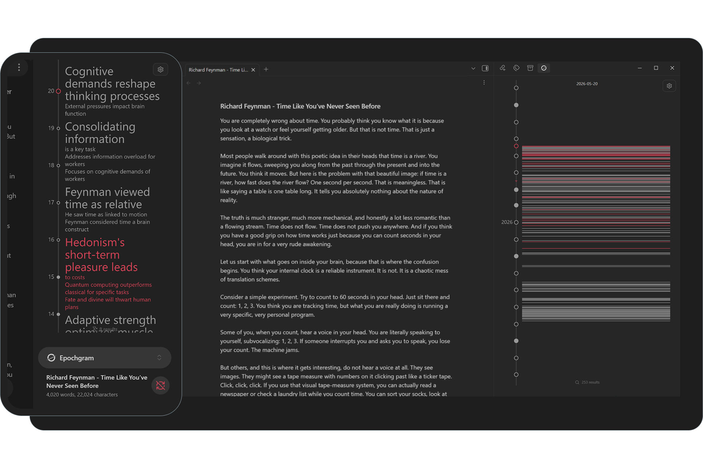
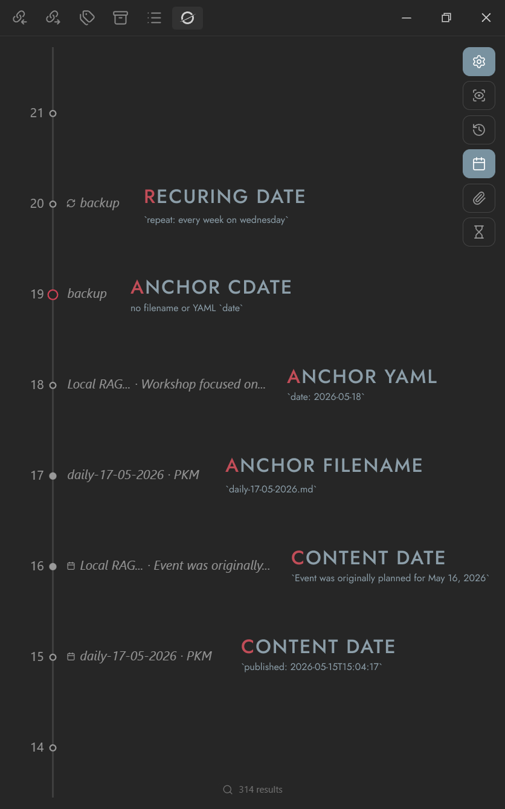
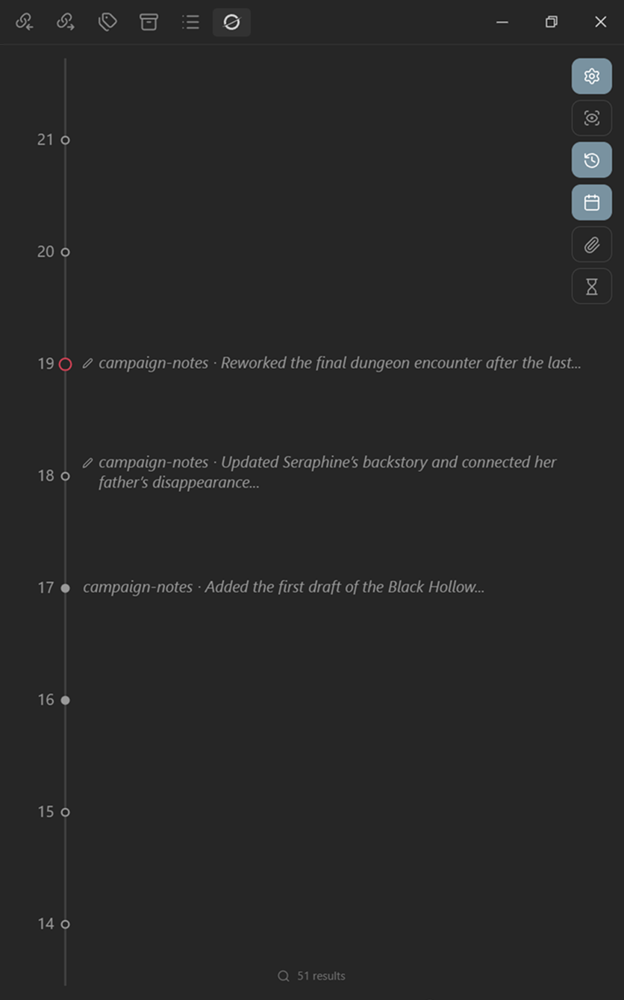

<h1 align="center"></h1>

<h5 align="center">
A Timemap of Your Mind
</h5>

<p align="center">
  <a href="https://github.com/2brn/Epochgram/releases">
    
  </a>
  <a href="https://github.com/2brn/Epochgram/releases">
    
  </a>
</p>

</br>
<p align="center"></p>
</br>

> <font color="#c14d58">Pain</font>. Your vault fills up with quick capture notes. A week later, you've lost the thread. A month later, you can't reconstruct the story — and you don't see the themes, the slow stretches, or the bursts of activity.</br></br>
> <font color="#c14d58">Solution</font>. Epochgram turns your notes into an AI-powered interactive timeline. Browse day by day to scan changes in order, spot bigger patterns across unsorted notes, and edit directly on the timeline — so you can focus on what really matters.</br></br>
> <font color="#c14d58">Epochgram Pro</font> adds even more overview:
> - On-device or cloud AI summaries via AI bridge.
> - Epochs: a zoomable timemap, from daily detail to a year overview.
> - Find related notes through links, tags, titles, and semantic similarity.
> - Topic clustering and marked related groups.
> - Tracked content edits.
> - Recurring events.

## Table of Contents

- [Get Started](#get-started)
- [Timeline](#timeline)
- [Examples](#examples)
- [Filters](#filters)
- [Search](#search)
- [Actions](#actions)
- [Review State](#review-state)
- [Recurring (Pro)](#recurring-pro)
- [Similarity (Pro)](#similarity-pro)
- [AI bridge (Pro)](#ai-bridge-pro-desktop-only)
- [Epochs (Pro)](#ai-summaries--epochs-pro-desktop-only)
- [Custom YAML](#custom-yaml)
- [Settings & Data](#settings--data)
- [FAQ](#faq)
- [Disclosures](#disclosures)

## Get Started

### Download

Install from **[Obsidian Community plugins](https://community.obsidian.md/plugins/epochgram)**

BRAT

- Install [BRAT](https://community.obsidian.md/plugins/obsidian42-brat) community plugin in Obsidian.
- Use [Obsidian protocol](https://www.epochgram.com/brat) to add Epochgram.
- Or Obsidian Settings → BRAT → Add beta plugin [https://github.com/2brn/Epochgram](https://github.com/2brn/Epochgram).

Manual install

- Download the latest release files from [GitHub releases](https://github.com/2brn/Epochgram/releases).
- Copy files into your vault plugin folder: `.obsidian/plugins/epochgram`.
- Enable Epochgram in Obsidian Settings → Community plugins.

> [!TIP]
> Click the  ribbon icon or run **⌘ Epochgram: Open timeline** to show the timeline in the right sidebar.</br>
> To open it automatically on launch, enable **⛭ Open on startup**.

### Cheatsheet

| Shortcut | Description |
| --- | --- |
| **Click** record | Open the file |
| **Click** date | Open the daily note |
| **Ctrl/Cmd+Click** record | Open the file in a new tab |
| **Right-Click** or **Long-Tap** record or date | Open the context menu |
| **Right-Click** or **Long-Tap** empty space | Toggle Epochs view (Pro) |
| **Double-Click** empty space | Scroll to Today |
| **Double-Click** date | Create a new daily note |
| **Wheel** or **Pan** | Scroll |
| **Ctrl/Cmd+Wheel** or **Pinch** | Zoom |
| **Alt/Option+Wheel/Up/Down** or **Two-Finger-Tap** | Jump to the next/previous similar record |
| **Shift+Wheel** | Zoom around the current record |
| **Alt/Option+Hover** record | Show the file preview |
| **Drag-N-Drop** record | Change its date |

### Activating Pro
- Follow the instructions on [epochgram.com/pro](https://www.epochgram.com/pro) to get your activation key by email.
- Open the link in the email or paste the key into **⛭ License key** to activate.
- Epochgram may periodically connect to the cloud service to verify your license.

## Timeline

<p align="center">


</p>

The timeline is a scrollable, zoomable surface that collects records from all files in the vault, excluding paths ignored in Obsidian settings. It detects dates and date ranges in different formats and renders **one record per file per day**, in the following **priority order**:

| Source | Description |
| --- | --- |
|  **Tracked changes** | Per-block edit history excluding YAML. Requires **⛭ Track changes** (Pro). |
|  **Content date** | Parsed content date (ranges), including  **Recurring dates** (Pro). |
| -- Anchors -- | |
| **Filename date** | Parsed filename date. |
| **Frontmatter date** | YAML **⛭ Anchor property**. |
| **File cdate or mdate** | Configurable via **⛭ Anchor mdate**. |

Each file has one anchor record that represents its canonical date. All other record types are optional. Drag and drop works only for anchor records, it updates the YAML **⛭ Anchor property**, and the filename for daily notes.

> [!TIP]
> Enable **⛭ Parse all properties** to extract dates from all YAML frontmatter.

<p align="center">


</p>

Each record appears as `file ⸱ summary`. You can control the length of each part using **⛭ Filename length** and **⛭ Summary length**. The summary is either the first `N` words extracted from Markdown or an AI-generated summary when **⛭ Auto summarize** is enabled (Pro). You can also set a manual summary using YAML **⛭ Summary property** or via context menu ** Edit summary…**; manual summaries are always preferred over AI-generated ones.

> Use this [CSS snippet](https://obsidian.md/help/snippets) to make the timeline full width on mobile:
> ```css
>  body.is-mobile {
>    --mobile-sidebar-width: 100vw;
>  }
> ```

Timeline draws today as , weekdays as  and weekends as . Entries are shown stacked or side by side when space allows, long entries are truncated with `…`. When records no longer fit within the **⛭ Record width limit**, the rest collapse into `(+n)`. When zoomed out, records collapse into placeholder bars , with height based on record count.

> [!TIP]
> Clicking a `(+n)` collapsed record or Epoch cycles through the grouped files.</br>
> A top label shows the current date, and a vertical red line marks the distance from Today — at the default zoom, each day of redshift represents one month.

## Examples

Let's assume you have the following notes in your vault:

`backup.md`
```text
---
repeat: every week on wednesday
---
```

`Local RAG workshop.md`
```text
---
date: 2026-05-18
---

Workshop focused on building local RAG pipelines with Ollama, vector embeddings, and semantic search across Markdown knowledge bases.

Event was originally planned for May 16, 2026, but was later postponed due to severe weather conditions.
```

`daily-17-05-2026.md`
```text
---
published: 2026-05-15T15:04:17
description: PKM
---

[Personal knowledge management](https://en.wikipedia.org/wiki/Personal_knowledge_management)
```

And these Epochgram settings:

| Setting | Value |
| --- | --- |
| **⛭ Anchor mdate** | `off` |
| **⛭ Anchor property** | `date` |
| **⛭ Summary property** | `description` |
| **⛭ Parse all properties** | `on` |
| **⛭ Filename length** | `2 words` |
| **⛭ Summary length** | `5 words` |

> [!TIP]
> You can hide all content dates by turning off the  toggle.

After indexing, you will see the following records on the timeline:

<p align="center">

</p>

**⛭ Track changes** lets you review file history on the timeline. For example, you have a long document you edit every day:

`campaign-notes.md`
```text
Added the first draft of the Black Hollow region, including the mining town, nearby ruins, and the main faction leaders.

Updated Seraphine’s backstory and connected her father’s disappearance to House Vaelor. Also added notes for the underground smuggler tunnels.

Reworked the final dungeon encounter after the last session. Added shadow creatures, new traps, and alternative paths for stealth-focused players.
```

> [!TIP]
> You can hide all tracked changes by turning off the  toggle.

Then you will see your edit history on the timeline, day by day:

<p align="center">

</p>

Each day you edit the document, the latest changed block is shown as  added,  changed, or  removed.

## Filters

<p align="center">

</p>

You can show or hide specific types of records using collapsible filters under the  button:

| Filter | Description |
| --- | --- |
|  | Show drafts only. |
|  | Show tracked changes (Pro). |
|  | Show content dates, ranges, and recurring. |
|  | Show non-text files. |
|  | Toggle Epochs view (Pro). |

## Search

<p align="center">

</p>

A search bar at the bottom lets you search timeline records and shows the number of matches. Click it or run **⌘ Epochgram: Search timeline**. Search supports fuzzy matching across filenames, content, summaries, Epochs, and all indexed attributes.
  
| Search shortcut | Description |
| --- | --- |
| **Enter** | Open the matched file. |
| **Ctrl/Cmd+Enter** | Open the matched file in a new tab. |
| **Alt/Option+Enter** | Filter timeline records by the current query. |
| **$marked** | Show only marked records. |
| **$hidden** | Show only hidden records. |
| **$similar** | Show only similar records to currently opened file. |
| **$current** | Show only records from the currently opened file. |
| **"exact"** | Find exact string. |

> [!TIP]
> Use **⛭ Search results count** to control how many suggestions are shown in the search popup.

## Actions

<p align="center">

</p>

Files in the vault are never modified unless you run an explicit file action. All attributes except the **date** and **manual summary** are stored in Epochgram data files, not in vault files.

| Record menu | Description |
| --- | --- |
| ** Edit summary…** | Update the file manual summary. |
| ** Set topic…** | Open the topics assignment popup; to remove topics, clear the input (Pro). |
| ** Pin** | Pin the file at the **Today** position; or **⌘ Epochgram: Toggle pin for current file**. |
| ** Mark** | Mark similar records with a color; or **⌘ Epochgram: Toggle mark for current file**. |
| ** Draft**</br>** Review**</br>** Hide** | Change the file review state. |
| ** Rename…** | Rename the file in the vault. |
| ** Move to…** | Move the file to another folder. |
| ** Delete** | **Permanently delete** the file, or move it to trash, depending on Obsidian settings. |

> [!TIP]
> **⌘ Epochgram: Clear tracked changes for current file** → clear all file history at once.

| Date menu | Description |
| --- | --- |
| ** Create daily note** | Uses **⛭ Daily notes** core plugin settings for that date: date format, location, and template. You can also create daily records by **Double-click** a date. |

## Review State

Epochgram is designed around the [C.O.D.E.](https://fortelabs.com/blog/basboverview/) process (Capture → Organize → Distill → Express). New or indexed files appear as ***Draft***. After organizing the file and extracting the key points, the record can be set as **Reviewed**. If the file changes later, the record returns to ***Draft***, indicating it may need review again.

Not every record deserves space on the timeline. Some, such as minor tracked changes, can be set **Hidden**. Hidden records disappear from the timeline by default. Use `!hidden` in search to show only hidden records — they are rendered muted.

> [!TIP]
> **⌘ Epochgram: Review all** → set all records across the vault as reviewed.</br>
> **⌘ Epochgram: Toggle visibility for current file** → hide or show all records from the current file.

## Recurring (Pro)

<p align="center"></p>

You can create recurring records, which will appear on the timeline. To add one, set the `repeat` or `recur` property in YAML. Supported formats (see [RRULE](https://icalendar.org/iCalendar-RFC-5545/3-8-5-3-recurrence-rule.html)):

```yaml
---
repeat: every day
repeat: every N days from YYYY-MM-DD count N
repeat: every week on monday,tuesday from YYYY-MM-DD to YYYY-MM-DD
repeat: every N weeks on mon,tue
repeat: every month on D until YYYY-MM-DD
repeat: every month on -D # D days from end of month; -1 = last day
repeat: every year on MM-DD
repeat: FREQ=DAILY;COUNT=5 # RRULE
---
```
 
## Similarity (Pro)

<p align="center">
  
  
</p>

Similarity helps find related records. When you open a note, similar records on the timeline are marked using the current theme color. Epochgram includes multiple similarity settings that work across all platforms, including iOS and Android:

| Settings | Description |
| --- | --- |
| **⛭ Links** | Treat notes as related through inbound and outbound links. |
| **⛭ Tags** | Treat notes as related when they share tags. |
| **⛭ Title threshold** | Use Jaro–Winkler matching to group notes with similar names or paths. Higher values match more; `0` disables it; `1.0` switches to same-folder matching. |
| **⛭ Semantic threshold** | Use an embedding [default model](https://huggingface.co/Xenova/all-MiniLM-L6-v2) to find notes with similar meaning across the vault. Useful for notes that describe the same idea in different words. |
| **⛭ Topic threshold** | Use a zero-shot [default model](https://huggingface.co/MoritzLaurer/deberta-v3-xsmall-zeroshot-v1.1-all-33) for similarity grouping. When you assign a topic to a note, Epochgram finds related records across the vault. Useful for broad themes like travel, health, or photography, where notes may share meaning without direct links or tags. |

> [!TIP]
> Use **⛭** to open the model picker, or  to browse Hugging Face models.</br>
> Use only trusted models; third-party models, downloads, and licenses are your responsibility.

Building semantic vectors and running topic classification can take a long time on slower machines. Long-running jobs show their progress in the status bar — hover over the progress item to see all jobs, or click it to cancel.

**Similarity** also groups related records automatically: when you mark one record, related records inherit the same color. These records behave as one group, so changing or removing the color updates the whole group, and inherited marks are recalculated automatically if the relation later disappears.

In addition to the standard red-to-violet palette, an extended palette is available in the submenu. This makes it easy to choose colors by activity. For example, I use <font color="#ADD8E6">glacier</font> for ski trip reports.

<p align="center">
  
</p>

> [!TIP]
> **Alt/Option+Wheel/Up/Down** or **Two-Finger-Tap** → move through related records.</br>
> **⌘ Epochgram: Toggle mark for current file** → assign the next unique color from the palette.

## AI bridge (Pro, desktop-only)

<p align="center"></p>

Epochgram Pro includes an **AI bridge** for summarization jobs. When started, it runs a small local server on an available port at `http://127.0.0.1`. The bridge page can be opened from **⌘ Epochgram: Open AI bridge**, from the **⌀ AI** status bar button in the bottom-right (button absent → server not started; button red → client disconnected), or automatically on startup if **⛭ Open AI bridge on startup** is enabled. You can also enable **⛭ Open AI bridge in Obsidian** in settings to prefer opening the bridge inside Obsidian (cloud providers only). This page processes summary jobs and returns the results to the plugin. By default (`backend.mode: native`), processing uses the browser's built-in on-device Summarizer API (currently supported browsers are https://developer.mozilla.org/en-US/docs/Web/API/Summarizer). If you switch to `backend.mode: cloud`, requests are sent to your selected cloud provider.

> [!WARNING]
> Cloud mode sends notes data for summarization to the provider and consumes your API quota.

On first use of native summarization, a user gesture may be required to download the built-in Gemini Nano model, and the drive with your Google Chrome profile [should have](https://developer.chrome.com/docs/ai/summarizer-api#hardware-requirements) at least **22 GB** of free space. The bridge page also serves as a control panel, showing connection and model status, queue progress, the current text preview, the latest result, and a chart with progress in gray and processing speed in blue. Keep it open while summaries are running. For larger notes, Epochgram can split input into chunks, summarize them separately, then merge the results. You can also adjust API settings and prompt/context texts in the YAML settings editor:

```yaml
sharedContext: | # Shared instructions across all summarization jobs
  Ignore dates and empty content.
  Group by topics, compress, remove duplicates and metaphrases.
  Order by frequency.

format: plain-text # Output format: markdown | plain-text
preference: capability # Model preference: auto | speed | capability
expectedInputLanguages: [en] # Accepted input languages: en | es | ja
outputLanguage: en # Output language: en | ja | es
expectedContextLanguages: [en] # Accepted context languages: en | ja | es

backend: # Optional
  mode: native # native | cloud
  maxRetries: 3 # Required (minimum: 1), applies to native and cloud
  cloud: # Required only when mode: cloud
    provider: openai # gemini | openai
    apiKey: "{{your-openai-key-secret}}" # Secret Storage key placeholder (Settings > Keychain)
    modelName: gpt-4o-mini # Optional
    baseUrl: https://api.openai.com/v1 # Required for openai (use local endpoint for LM Studio/Ollama)

maxRelatedChars: 300 # Related-context size limit

reduce:
  context: | # Recursive reduction instructions
    Recursive summary reduction.
    Preserve dominant topics and recurring entities.

  type: tldr # Reduction summary type: key-points | tldr | teaser | headline
  length: long # Summary length: short | medium | long
  maxChunkChars: 3000 # Split threshold before recursive reduction
  maxDepth: 3 # Maximum recursive reduction depth

records:
  context: | # Per-record summarization instructions
    File:
    {{filePath}}
    
    Preserve facts, entities, terminology, and concrete topics.
    Remove repetition, filler, boilerplate, and metaphrases.

  type: tldr # Summary type: key-points | tldr | teaser | headline
  length: short # Summary length: short | medium | long

  maxInputChars: 3000 # Max source chars per record
  maxOutputWords: 30 # Max generated words (optional)

epochs:
  - period: day-2weeks # Supported  periods/ranges: day | 2days | 4days | week | 2weeks | month | 3months | 6months | year | day-year
    context: | # Epoch summarization instructions
      Short-term activity summary.
      Recent events, actions, tasks, places, people, projects.
      Output max 12 words, nouns only.

    type: tldr # Summary type: key-points | tldr | teaser | headline
    length: short # Summary length: short | medium | long
    maxFileChars: 300 # Max chars taken per file
    maxOutputWords: 30 # Max generated words (optional)

  - period: month-year
    context: |
      Broad period summary.
      Long-term themes, domains, projects, interests, recurring topics.
      Output max 12 words, nouns only.

    type: tldr
    length: medium 
    maxFileChars: 300 
    maxOutputWords: 30
```

> [!TIP]
> Chrome's built-in Gemini Nano currently officially supports English, Spanish, and Japanese for input and output text. You can still try forcing another output language in the prompt context; for example, I used this context for Ukrainian: `OUTPUT ONLY IN UKRAINIAN!`.

## AI Summaries & Epochs (Pro, desktop-only)

**⛭ Auto summarize** → when enabled, Epochgram automatically summarizes timeline records through the **AI bridge** whenever the file changes. It does not modify the file content.

**⛭ Generate Epochs** → when enabled, Epochgram creates a zoomable timemap that groups many days into larger period summaries, helping you see the bigger picture without reading the timeline day by day. Epochs are generated hierarchically from day up to year, in essence, summaries of summaries. If marked records are present, Epochs are colored by the most common mark color in that range. You can regenerate a specific Epoch from the context menu.

> [!TIP]
> **⌘ Epochgram: Summarize current file** → generate AI summaries for current file records on timeline.</br>
> **⌘ Epochgram: Summarize missing** → generate all missing summaries and Epochs across the entire vault.

## Custom YAML

Epochgram supports the following custom YAML properties:

```yaml
---
date: 2026-01-01 # override the anchor date
description: my summary # override the summary
pin: today # today | date (visible at any zoom) | dock (also outside viewport)
mark: "#c14d58" # explicit mark color (hex)
noindex: # exclude this file from all indexing
notracked: # don't track changes for this file
noparsed: # don't parse dates from this file's content
nosimilar: # don't match this file by similarity
similar: [links, tags, title, semantics, topics] # match similarity only by these relations
repeat: every day # create recurring records
recur: every day # same as repeat
---
```

## Settings & Data

<p align="center"></p>

Plugin data is mostly stored in the vault config directory, usually `.obsidian/`.

| File | Description |
| --- | --- |
| `epochgram-index.json` | Timeline/index data. |
| `epochgram-search.json` | Search cache. |
| `epochgram-summaries.json` | AI summaries and Epochs. |
| `epochgram-semantics.json` | Embeddings store. |
| `epochgram-topics.json` | Topic similarity store. |
| `plugins/epochgram/data.json` | Settings and view state. |

If Obsidian Sync is enabled, this data should synchronize between devices as long as **⛭ Sync → Vault configuration sync → Other file types** is turned on. License data is stored separately in `localStorage` and is not synced through the vault config.

> [!TIP]
> **Double-Click** a setting name/description → reset it to default.

Epochgram also provides **Rebuild** and **Reset** popups for rebuilding or clearing stored data:

- **⛭ Rebuild**
    - **⛭ All** → rebuild all data.
    - **⛭ Index** → rebuild the index; useful if something is broken or after an update.
    - **⛭ Search** → rebuild the [MiniSearch](https://github.com/lucaong/minisearch) cache.
    - **⛭ Semantics** → rebuild embedding vectors.
    - **⛭ Topics** → reclassify topics.
    - **⛭ AI summaries** → queue all files for AI summary generation.
    - **⛭ Epochs** → queue all Epochs for regeneration.
- **⛭ Reset**
    - **⛭ All** → reset all data and settings to defaults, keep license data, then rerun indexing.
    - **⛭ Settings** → reset all settings to defaults.
    - **⛭ Data files** → clear data files and schedule regeneration.
    - **⛭ Search** → clear the search cache.
    - **⛭ Reviews** → set all records to draft.
    - **⛭ Semantics** → remove all embedding vectors.
    - **⛭ Topics** → remove all topics and classification data.
    - **⛭ Tracked changes** → remove all tracked changes.
    - **⛭ AI summaries** → remove all AI summaries and use default "first N words".
    - **⛭ Epochs** → remove all Epochs.

> [!TIP]
> **⛭ Version X.X.X** shows the current version, build timestamp, and a link to the [CHANGELOG](CHANGELOG).

## FAQ

> **How do I get support?**  
> Check the docs first. If you still cannot find what you need, feel free to [open an issue on GitHub](https://github.com/2brn/Epochgram/issues). You can also join the [Reddit community](https://www.reddit.com/r/Epochgram/) for discussions, feedback, and updates. If you have any other questions, just contact me at hi@epochgram.com.

> **What should I do if Epochgram feels slow?**  
> On huge vaults or slower machines, performance may degrade. Try setting **⛭ Semantic threshold** and **⛭ Topic threshold** to `0`, disable **⛭ Auto summarize** and **⛭ Generate Epochs**. You can also uncheck **⛭ Enable animation** or reset plugin data.

> **What should I do if some records are missing?**  
> Try rebuilding the index or reload Obsidian.

> **What should I do if Obsidian cannot start and I suspect Epochgram?**  
> Try restarting Obsidian first. If it still cannot start, temporarily disable Epochgram by moving or deleting the `.obsidian/plugins/epochgram` folder from your vault, then start Obsidian again.

## Disclosures

- Epochgram Pro:
	- Requires a payment and internet access for license validation; your email address, license key, and basic server-side telemetry may be processed (see [TERMS](https://www.epochgram.com/terms)).
  - Is not affiliated with Obsidian Sync, Publish, or other Obsidian paid services.
  - AI bridge: Epochgram starts a local server on `http://127.0.0.1` and opens a local bridge page for summarization jobs. In native mode, it uses browser's built-in on-device Summarizer API and the bridge communication stays on your device. In cloud mode, summary data is sent to your selected provider and consumes your API quota. Google Chrome [may download](https://developer.chrome.com/docs/ai/summarizer-api) its built-in model(s) (Gemini Nano) the first time you use native summarization APIs.
  - Similarity: embeddings/topic models and runtime files may be downloaded on first use via `@huggingface/transformers` (for example from [Hugging Face](https://huggingface.co)) and ONNX Runtime Web WASM from [jsDelivr](https://cdn.jsdelivr.net/npm/onnxruntime-web@1.24.3/dist/).
- All vault data is processed locally on your device and is NEVER sent over the internet, except when you explicitly use cloud summarization providers.
- License: MIT (see [LICENSE](LICENSE)).